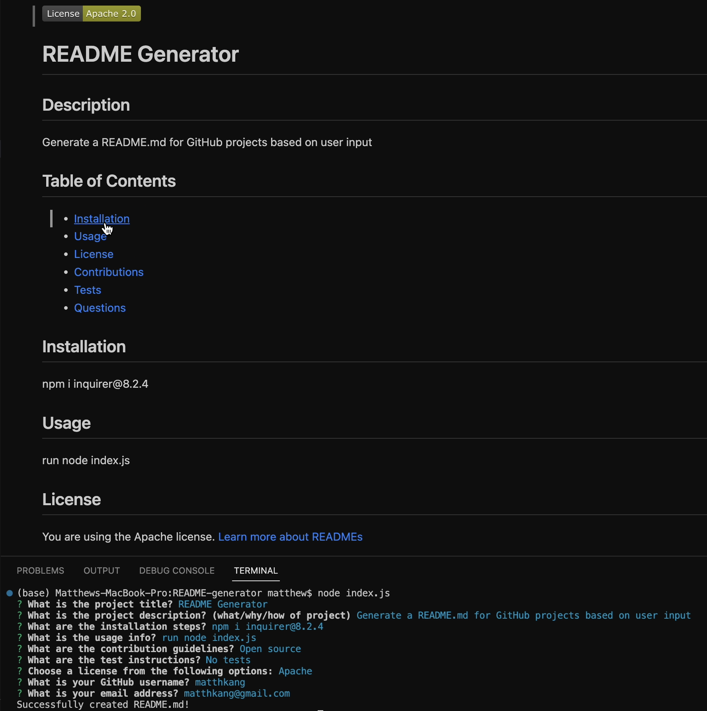

  
  # README Generator

  ## Description
  
  Generate a README.md for GitHub projects based on user input
  
  ## Table of Contents
  
  - [Installation](#installation)
  - [Usage](#usage)
  - [License](#license)
  - [Contributions](#contributions)
  - [Tests](#tests)
  - [Questions](#questions)
  
  ## Installation
  
  npm i inquirer@8.2.4
  
  ## Usage
  
  run node index.js

  Sample README file created based on user's responses to questions:
  

  Video demonstrating application: [README Generator Demo](https://drive.google.com/file/d/1YbWh0bZNiJSIABiMj1u3t8LGR4nc-7sr/view?usp=sharing)
  
  ## License
  
  You are using the Apache license. [Learn more about READMEs](https://docs.github.com/github/creating-cloning-and-archiving-repositories/licensing-a-repository)
  
  ---
  
  ## Contributions
  
  Open source
  
  ## Tests
  
  No tests
  
  ## Questions
  
  Take a look at my other projects: [GitHub Profile](https://github.com/matthkang)

  You can reach me via email at: [matthkang@gmail.com](mailto:matthkang@gmail.com)
